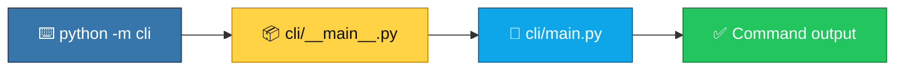

<p align="center">
  
</p>

<h1 align="center">python-cli-starter</h1>

<p align="center">
  <strong>EN</strong> argparse CLI skeleton with example requirements.txt<br/>
  <strong>PT</strong> Skeleton de CLI argparse com requirements.txt de exemplo
</p>

<p align="center">
  <a href="https://github.com/manansbdb/python-cli-starter/blob/main/LICENSE"></a>
  
  
  <a href="#support--apoio"></a>
</p>

---

## What it does / Para que serve

| English | Português |
|---------|-----------|
| A small **Python argparse CLI** package you can run with `python -m cli`. | Um pacote **CLI argparse** em Python que podes correr com `python -m cli`. |
| Install optional deps from `requirements.txt`, then extend `cli/main.py`. | Instala deps opcionais de `requirements.txt` e estende `cli/main.py`. |



---

## Install / Instalação

### 1) Clone / Clona

```bash
git clone https://github.com/manansbdb/python-cli-starter.git
cd python-cli-starter
```

### 2) Optional deps / Deps opcionais

```bash
python -m venv .venv
source .venv/bin/activate   # Windows: .venv\Scripts\activate
pip install -r requirements.txt
```

### 3) Run / Corre

```bash
python -m cli --help
```

### Requirements / Requisitos

- Python 3.10+
- `pip` (optional extras)

---

## Quick start / Início rápido

```bash
git clone https://github.com/manansbdb/python-cli-starter.git
cd python-cli-starter
python -m cli --help
```

---

## Contents / Conteúdos

| Path | Purpose / Função |
|------|------------------|
| `cli/main.py` | argparse entry logic |
| `cli/__main__.py` | `python -m cli` hook |
| `requirements.txt` | Example deps (e.g. rich) |
| `SUPPORT.md` | Donations / Doações |

---

## Project layout / Estrutura

```text
python-cli-starter/
├── docs/banner.svg
├── requirements.txt
├── cli/__init__.py
├── cli/__main__.py
├── cli/main.py
├── SUPPORT.md
└── README.md
```

---

## Support / Apoio

Bitcoin donations welcome / Doações em Bitcoin bem-vindas:

```
bc1q0qfnlnxyum9u45stzxe0a7jnhtj4j0usfkqdjw
```

See [SUPPORT.md](./SUPPORT.md).

---

## License / Licença

[MIT](./LICENSE) © 2026 manansbdb
